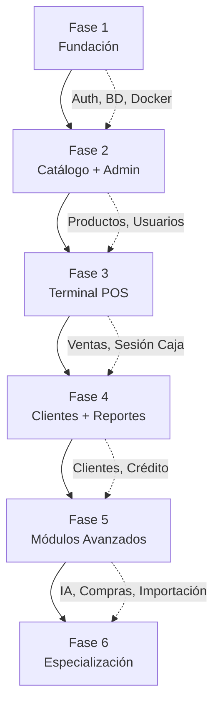

# CUDII POS — Plan de Desarrollo General (PLAN_DESARROLLO.md)

> **Versión:** 2.0  
> **Fecha de Revisión:** 2026-07-31  
> **Estado:** Documento vivo — actualizar al completar cada fase.

---

## 1. Objetivo General

Construir **CUDII**, una plataforma SaaS multitenant de Punto de Venta (POS) para el mercado mexicano y latinoamericano, que permita a cualquier comercio —desde una tiendita de abarrotes hasta una cadena de sucursales— operar su negocio de forma digital en menos de 15 minutos desde el registro.

El sistema debe ser:
- **Robusto y auditable:** cada transacción económica o de inventario es rastreable, inmutable e íntegra.
- **Extensible:** cualquier integración externa (pasarelas de pago, facturación, IA) se conecta bajo el patrón Adapter/Strategy sin reescribir lógica de negocio.
- **Multirol:** la interfaz se adapta completamente al rol del usuario autenticado (Cajero, Gerente, Admin).
- **Cloud-First:** todo opera sobre PostgreSQL + NestJS en la nube, con soporte offline planificado como deuda técnica.

---

## 2. Alcance del Proyecto

### Incluido en el roadmap completo:
- POS web completo (cobro, inventario, cortes de caja, devoluciones)
- Gestión de catálogo de productos con múltiples unidades de venta y precios escalonados
- RBAC granular (6 roles + permisos por módulo)
- Gestión de clientes y programa de lealtad
- Cortes X/Z (modo ciego y abierto)
- Módulo de crédito y fiados
- Órdenes de compra a proveedores
- Migración asistida de datos desde otros sistemas
- IA conversacional en dashboard
- Facturación CFDI 4.0
- Módulo de restaurantes (comandas, mesas, KDS)
- Integración de periféricos (básculas, impresoras térmicas, cajón)

### Fuera del alcance inicial (deuda técnica):
- Soporte offline completo (Fase 6+)
- App móvil nativa (Expo)
- E-commerce integrado

---

## 3. Arquitectura de Alto Nivel

```
┌──────────────────────────────────────────────────────┐
│                    CLIENTE (Browser)                 │
│           Vite + React + TailwindCSS                 │
│       Roles: Cajero, Almacén, Gerente, Admin         │
└───────────────────────┬──────────────────────────────┘
                        │ HTTPS / REST / WebSocket
┌───────────────────────▼──────────────────────────────┐
│                BACKEND (NestJS)                      │
│  Módulos: auth | tenant | branch | pos | inventory   │
│           sales | reports | credits | adapters       │
│  Guards RBAC | DTOs | Global Exception Filter        │
└──────┬────────────────────────────────┬──────────────┘
       │                                │
┌──────▼──────┐                  ┌──────▼──────┐
│ PostgreSQL  │                  │    Redis    │
│  (Prisma)   │                  │  (Sesiones, │
│  Multitenant│                  │   Caché)    │
└─────────────┘                  └─────────────┘
```

**Patrón de módulos NestJS:**
```
src/
├── common/           # Filtros, Guards, Decoradores, Interceptores
├── config/           # Variables de entorno y configuración global
└── modules/
    ├── auth/
    ├── tenant/
    ├── branch/
    ├── pos/          # Venta, Caja, Cortes
    ├── inventory/    # Productos, Categorías, Stock, Movimientos
    ├── sales/        # Ventas, Detalles, Pagos
    ├── customers/    # Clientes, Lealtad, Crédito
    ├── reports/
    ├── imports/      # Migración asistida
    └── adapters/     # Pagos, CFDI, IA (Pattern Strategy)
```

---

## 4. Lista de Fases

| Fase | Nombre | Descripción Corta | Versión | Estado |
|------|--------|-------------------|---------|--------|
| **1** | Fundación e Infraestructura | Docker, BD base, Auth, Onboarding | MVP base | ✅ Completada |
| **2** | Catálogo y Gestión de Inventario | CRUD Productos, Categorías, Stock, Usuarios | MVP pre-caja | ✅ Completada |
| **3** | Terminal POS y Ciclo de Venta | Apertura de caja, Venta, Cortes, Devoluciones | V1.0 | ✅ Completada |
| **3+** | Trazabilidad y Lotes | FEFO/FIFO, caducidad, merma, granel, descuentos, validación unidades | V1.0+ | ✅ Completada |
| **4** | Clientes, Dashboard, Reportes y Arquitectura | Lealtad, Fiados, Dashboard, Reportes, fix N+1, paginación, índices | V1.5 | 🔴 Pendiente |
| **5** | Módulos Avanzados (V2.0) | IA, Compras, Migración, Notificaciones | V2.0 | 🔴 Pendiente |
| **6** | Especialización (V3.0) | CFDI 4.0, Restaurantes, Periféricos, Offline | V3.0 | 🔴 Pendiente |

---

## 5. Descripción Resumida por Fase

### Fase 1 — Fundación e Infraestructura
Establece los cimientos técnicos del proyecto: entorno Docker, esquema de base de datos multitenant, autenticación JWT con RBAC y el flujo de Onboarding Asistido (Día 0). Esta fase no tiene interfaz de caja, pero sí la UI de login y el wizard de alta.

**Entregables clave:** `docker-compose.yml`, `schema.prisma` (entidades base), módulos `auth` y `onboarding`, `LoginView`, `OnboardingView`.

---

### Fase 2 — Catálogo y Gestión de Inventario
Construye las pantallas de administración que son prerequisito para que el cajero pueda operar. Sin esta fase, no hay productos que vender ni usuarios que asignar a una caja.

**Entregables clave:** CRUD de Categorías, CRUD de Productos (con unidades de medida), Gestión de Stock (ajustes manuales), CRUD de Usuarios con roles, rutas protegidas del panel admin.

---

### Fase 3 — Terminal POS y Ciclo de Venta
Implementa el corazón del negocio: la pantalla del cajero. Incluye apertura de sesión de caja, flujo completo de venta (carrito → cobro → ticket), cortes X/Z y devoluciones básicas.

**Entregables clave:** Modelos `Venta`, `DetalleVenta`, `PagoVenta`, `SesionCaja`, `CorteX`, `CorteZ`, `Devolucion`. Terminal POS con 2 paneles, modal de cobro y flujo de devolución.

---

### Fase 3+ — Trazabilidad y Lotes (extensión de Fase 3)
Extiende el sistema de venta con trazabilidad completa de inventario: consumo FEFO/FIFO de lotes, gestión de caducidades, merma, venta a granel con decimales, descuentos por monto fijo y validación de unidades de medida (discreta vs continua).

**Entregables clave:** Módulo `inventory` extendido (lotes, movimientos, caducidad), `consumirLotes` con FEFO, validación de unidades (`unidad.util.ts`), devoluciones a stock/merma, descuentos (general + por item), suite de pruebas API (39 tests).

**Documentación:** `docs/FASE4_Trazabilidad.md`, `docs/GUIA_PRUEBAS_FASE4.md`, `.agents/REGLAS_NEGOCIO.md`.

---

### Fase 4 — Clientes, Dashboard, Reportes y Arquitectura
Añade fidelización, visibilidad operacional y **consistencia arquitectónica** completa. Incluye limpieza de schema (campos muertos), 25+ índices en FKs críticas, fix de N+1 queries, paginación estandarizada, y resolución de endpoints huérfanos. También implementa clientes con crédito/fiados, programa de puntos, dashboard con KPIs reales y reportes exportables.

**Entregables clave:** Limpieza de schema + índices + fix N+1 + paginación consistente. Modelos `Cliente`, `CuentaCreditoCliente`, `VentaCredito`, `AbonoCredito`. Dashboard con KPIs, 5 reportes exportables (CSV), historial de ventas/devoluciones, RBAC en sidebar.

---

### Fase 5 — Módulos Avanzados (V2.0)
Incorpora inteligencia operacional: IA conversacional en el dashboard, órdenes de compra a proveedores, migración asistida con IA, notificaciones multicanal y códigos de barras/etiquetas.

**Entregables clave:** Adaptador LLM (Strategy), módulo `orders` (compras), módulo `imports` (migración), integración de notificaciones (Telegram, Email), generación de códigos de barras e impresión de etiquetas.

---

### Fase 6 — Especialización (V3.0)
Amplía CUDII a nuevos giros y cumplimiento fiscal: facturación CFDI 4.0 con timbrado real, módulo de restaurantes (mesas + comandas), integración completa de periféricos (báscula, impresora) y soporte offline parcial.

**Entregables clave:** Adaptador PAC (CFDI), módulo `restaurant` (mesas, comandas, KDS), `local-helper` (WebSocket periféricos), PWA con cache offline.

---

## 6. Dependencias entre Fases

```
Fase 1 ──► Fase 2 ──► Fase 3 ──► Fase 4 ──► Fase 5 ──► Fase 6
  │           │           │
  └─ Auth     └─ CRUD     └─ Ventas, Caja, Devoluciones
     RBAC        Admin       (requiere Fases 1+2)
     Onboarding  (requiere   
     (requiere   Fase 1)
     Docker)
```

**Regla estricta:** Ninguna fase puede iniciar sin que la anterior esté **completada, validada y sus entregables verificados**.

---

## 7. Flujo Completo del Desarrollo



---

## 8. Criterios para Avanzar entre Fases

Una fase se considera **terminada** únicamente cuando:

1. **Todos sus entregables existen** en el repositorio.
2. **Los criterios de salida** del archivo `FaseN.md` están marcados como cumplidos.
3. **Las pruebas de validación** documentadas en `FaseN.md` se han ejecutado sin errores.
4. **Las dependencias para la siguiente fase** han sido producidas y son accesibles.

No se puede avanzar por presión de tiempo. Si una validación falla, se corrige antes de continuar.

---

## 9. Riesgos Generales

| Riesgo | Probabilidad | Impacto | Mitigación |
|--------|-------------|---------|------------|
| Cambio de requerimientos entre fases | Media | Alto | Documentar decisiones en SPEC.md antes de codificar |
| Regresiones al extender el schema Prisma | Alta | Alto | Usar migraciones nombradas; nunca editar migraciones existentes |
| Pérdida de atomicidad en transacciones de venta | Baja | Crítico | Toda operación de venta usa `prisma.$transaction` obligatoriamente |
| Bloqueo de API externa (CFDI, pagos) | Alta | Medio | Patrón Adapter; todos los adaptadores tienen modo mock |
| Deuda técnica de autenticación mal escalada | Media | Alto | Diseñar guards y decoradores genéricos desde Fase 1 |
| Inconsistencia de zonas horarias | Media | Medio | Regla estricta: UTC en BD, conversión solo en frontend |

---

## 10. Estrategia de Validación

- **Unit Tests (Jest):** Cada servicio crítico tiene tests de las reglas de negocio más importantes (cálculo de precios, validación de stock, cálculo de cambio).
- **Integration Tests:** Al finalizar cada fase se ejecutan tests contra la BD de prueba en Docker.
- **Pruebas Manuales Documentadas:** Cada `FaseN.md` incluye una sección de verificación manual paso a paso con resultado esperado.
- **E2E (Cypress/Playwright):** Flujos críticos (login → venta → corte) automatizados al cierre de la Fase 3.

---

## 11. Matriz de Entregables por Fase

| Entregable | Fase Responsable |
|-----------|-----------------|
| `docker-compose.yml` completo | Fase 1 |
| `schema.prisma` — entidades base (Empresa, Sucursal, Caja, Usuario, Producto) | Fase 1 |
| Módulo `auth` (JWT + RBAC) | Fase 1 |
| `OnboardingView.tsx` + `onboarding.service.ts` | Fase 1 |
| Módulo `categories` (CRUD) | Fase 2 |
| Módulo `products` (CRUD completo + unidades de medida) | Fase 2 |
| Módulo `inventory` (ajustes + movimientos) | Fase 2 |
| Módulo `users` (CRUD + roles) | Fase 2 |
| Panel de administración (rutas protegidas) | Fase 2 |
| `schema.prisma` — entidades de venta (`Venta`, `DetalleVenta`, `PagoVenta`, `SesionCaja`, `CorteX`, `CorteZ`, `Devolucion`) | Fase 3 |
| Módulo `cash-register` (apertura/cierre de sesión de caja) | Fase 3 |
| Módulo `sales` (crear venta + transacción atómica) | Fase 3 |
| `PosView.tsx` (terminal de caja completa) | Fase 3 |
| Flujo de devoluciones | Fase 3 |
| `schema.prisma` — entidades de clientes (`Cliente`, `CuentaCreditoCliente`, `VentaCredito`) | Fase 4 |
| Módulo `customers` (CRUD + crédito + lealtad) | Fase 4 |
| Dashboard básico (ventas del día, alertas de stock) | Fase 4 |
| Módulo `reports` (reportes exportables) | Fase 4 |
| Adaptador LLM (Strategy Pattern) | Fase 5 |
| Módulo `orders` (órdenes de compra + proveedores) | Fase 5 |
| Módulo `imports` (migración asistida CSV/Excel) | Fase 5 |
| Integración de notificaciones multicanal | Fase 5 |
| Adaptador PAC (CFDI 4.0) | Fase 6 |
| Módulo `restaurant` (mesas, comandas, KDS) | Fase 6 |
| Servicio `local-helper` (WebSocket + periféricos) | Fase 6 |
| PWA + soporte offline parcial | Fase 6 |

---

## Documentos de Referencia

| Nivel | Documento | Descripción |
|-------|-----------|-------------|
| 1 | [AGENTS.md](.agents/AGENTS.md) | Orquestación, roles de IA y políticas |
| 2 | [SPEC.md](.agents/SPEC.md) | Especificación técnica y modelo multitenant |
| 3 | [BACKEND_STANDARDS.md](.agents/BACKEND_STANDARDS.md) | Estándares NestJS |
| 4 | [FRONTEND_STANDARDS.md](.agents/FRONTEND_STANDARDS.md) | Estándares React/Vite |
| 5 | [TESTING_STANDARDS.md](.agents/TESTING_STANDARDS.md) | Estrategia de pruebas |
| 6 | [DESIGN_SYSTEM.md](.agents/DESIGN_SYSTEM.md) | Sistema de diseño Whitelabel |
| 7 | [PERIPHERALS_SPEC.md](.agents/PERIPHERALS_SPEC.md) | Integración de hardware |
| 8 | [REGLAS_NEGOCIO.md](.agents/REGLAS_NEGOCIO.md) | Lógica de ventas, impuestos e inventario |
| 9 | [fases/Fase1.md](.agents/fases/Fase1.md) | Detalle completo Fase 1 |
| 10 | [fases/Fase2.md](.agents/fases/Fase2.md) | Detalle completo Fase 2 |
| 11 | [fases/Fase3.md](.agents/fases/Fase3.md) | Detalle completo Fase 3 |
| 12 | [fases/Fase4.md](.agents/fases/Fase4.md) | Detalle completo Fase 4 |
| 13 | [fases/Fase5.md](.agents/fases/Fase5.md) | Detalle completo Fase 5 |
| 14 | [fases/Fase6.md](.agents/fases/Fase6.md) | Detalle completo Fase 6 |
